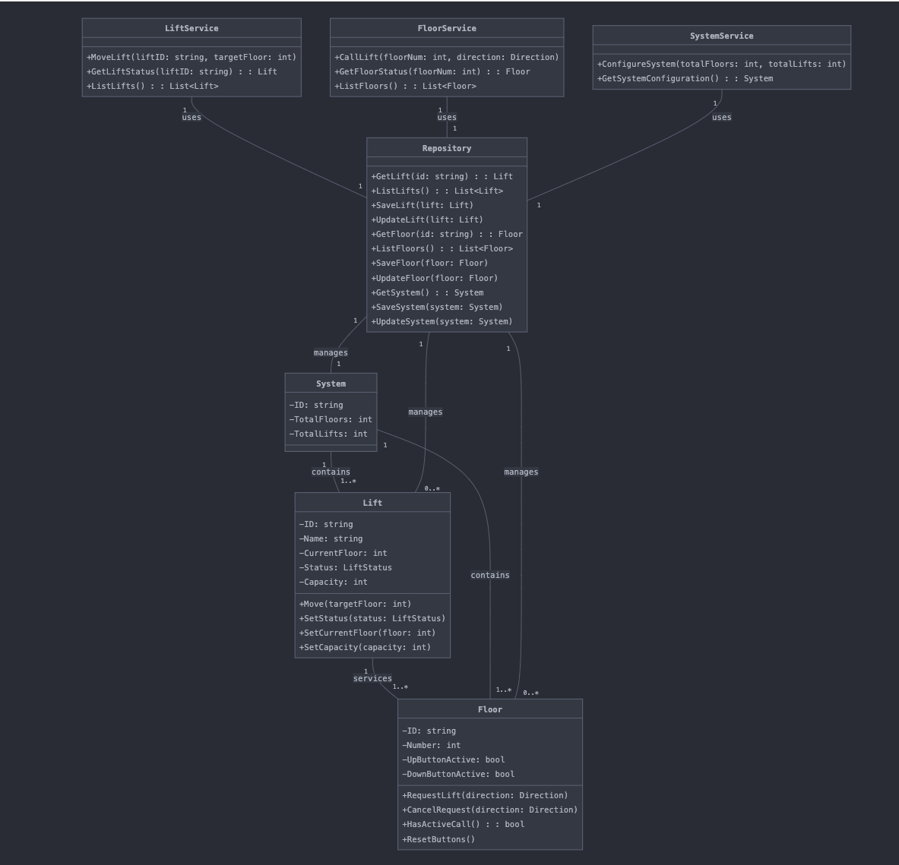
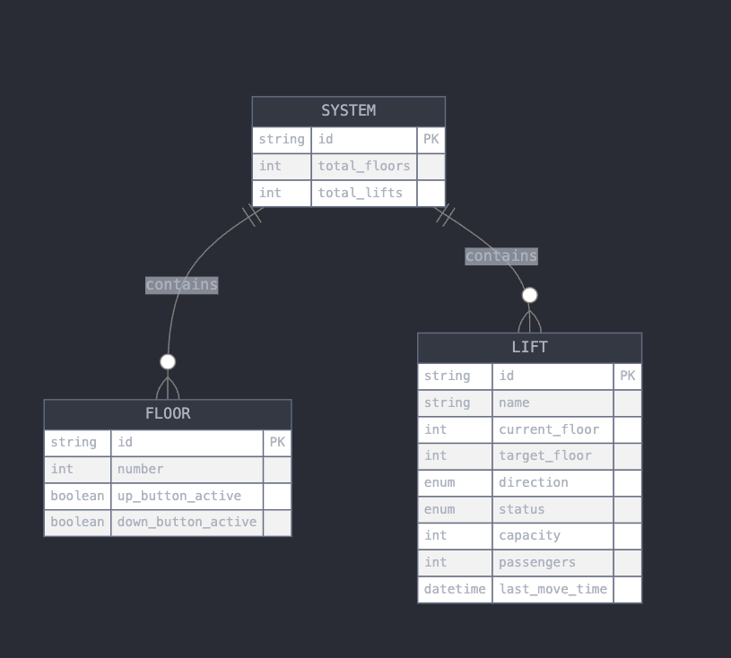

# Lift Simulation System

## Overview

The Lift Simulation System is a comprehensive solution designed to simulate and manage elevator operations in a multi-story building. This system provides a robust API for configuring, monitoring, and controlling lifts, making it ideal for testing elevator algorithms, building management systems, or educational purposes.

## System Architecture

### UML Class Diagram



The UML diagram above illustrates the core classes and their relationships in the Lift Simulation System.

### Entity-Relationship Diagram



The ER diagram provides a visual representation of the data model used in the Lift Simulation System.

## Swagger UI reference

https://api.subhrajit.me

## Key Features

- Dynamic system configuration (number of floors and lifts)
- Real-time lift status monitoring
- Simulated lift movement and door operations
- RESTful API for easy integration
- WebSocket support for real-time updates (#WIP)
- Intelligent lift assignment algorithm (#WIP)

NB : The system is still under development. #WIP - Work In Progress

## Getting Started

### Prerequisites

- Docker
- Docker Compose
- Go 1.23 or later (for local development)
- Make (for using the provided Makefile)

### Installation

1. Clone the repository:

---

```
   git clone git@github.com:Avyukth/lift-simulation.git
   cd lift-simulation
```

---

2. Set up environment variables:
   Copy the sample .env.example file as described below and modify as needed:

---

```
   cp src/.env.generated src/.env.development
```

---

3. Build and run the system using the provided Makefile:

---

```
   make up
```

---

## Usage

### Using the Makefile

The project includes a Makefile to simplify common tasks. Here are the available commands:

- `make build`: Build the lift-simulation Docker image
- `make lift-simulation`: Build only the lift-simulation Docker image
- `make up`: Build and start the containers using Docker Compose
- `make down`: Stop and remove the containers
- `make logs`: View container logs
- `make test`: Run the Go tests
- `make clean`: Remove containers, volumes, and images

To see all available commands, run:

---

```
make help
```

---

### API Endpoints

Once the system is up and running, you can interact with it using the following API endpoints:

- Configure the system: `POST /api/v1/system/configure`
- Get system status: `GET /api/v1/system/status`
- Call a lift: `POST /api/v1/floors/{floorNum}/call`
- Move a lift: `POST /api/v1/lifts/{liftId}/move`
- Get lift status: `GET /api/v1/lifts/{liftId}`

For a complete list of endpoints and their usage, refer to the API documentation.

## Development

To set up the development environment:

1. Install Go 1.23 or later
2. Install project dependencies:

   `Docker`

   `Docker Compose`

   `Make`

---

```
make build
make up
```

---

Go to

`http://localhost:80/swagger`

To see the system API details.

## Project Structure

- `src/`: Contains the Go source code
- `deployments/`: Contains Docker and deployment-related files
- `Makefile`: Defines commands for building, running, and managing the project
- `docker-compose.yml`: Defines the multi-container Docker environment

## Contributing

We welcome contributions to the Lift Simulation System! Please read our contributing guidelines before submitting pull requests.

## License

This project is licensed under the MIT License - see the LICENSE file for details.

## Acknowledgments

- Thanks to all contributors who have helped shape this project
- Inspired by real-world elevator systems and simulation techniques

For more information, please contact the project maintainers.
