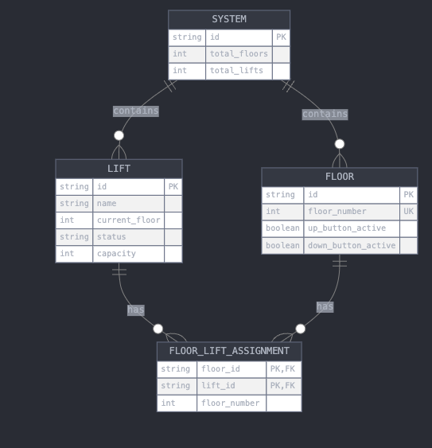

[](https://github.com/Avyukth/lift-simulation/actions/workflows/health-check.yml)

# Lift Simulation System

## Overview

The Lift Simulation System is a comprehensive solution designed to simulate and manage elevator operations in a multi-story building. This system provides a robust API for configuring, monitoring, and controlling lifts, making it ideal for testing elevator algorithms, building management systems, or educational purposes.

## System Architecture

### Control Flow Diagram


### UML Class Diagram


The UML diagram above illustrates the core classes and their relationships in the Lift Simulation System.

### Entity-Relationship Diagram



The ER diagram provides a visual representation of the data model used in the Lift Simulation System.

## Swagger UI reference

https://api.subhrajit.me

## Key Features

- Dynamic system configuration (number of floors and lifts)
- Real-time lift status monitoring
- Simulated lift movement and door operations
- RESTful API for easy integration
- WebSocket support for real-time updates
- Intelligent lift assignment algorithm (#WIP)

# WebSocket API for Lift Simulation System

This document describes the WebSocket API for real-time updates in the Lift Simulation System.

## Connection

Connect to the WebSocket server using one of the following URLs:

- Secure: `wss://projects.subhrajit.me/ws/connect`
- Unsecure: `ws://projects.subhrajit.me/ws/connect`

## Message Format

All messages sent and received through the WebSocket connection use JSON format.

### Subscription Message

To subscribe to updates for a specific floor or lift, send a message in the following format:

---

```json
{
  "type": "subscription",
  "data": {
    "type": "floor",
    "id": 2
  }
}
```

---

Or for a lift:

---

```json
{
  "type": "subscription",
  "data": {
    "type": "lift",
    "id": "7eac5bb4-8d7e-4072-a3f1-ca7b76241e94"
  }
}
```

---

### Update Messages

You will receive update messages in the following format:

For floors:

---

```json
{
  "type": "update",
  "data": {
    "type": "floor",
    "id": "2",
    "status": "display_updated:7eac5bb4-8d7e-4072-a3f1-ca7b76241e94",
    "currentFloor": 2
  }
}
```

---

For lifts:

---

```json
{
  "type": "update",
  "data": {
    "type": "lift",
    "id": "lift1",
    "status": "MOVING_UP",
    "currentFloor": 3
  }
}
```

---

## Status Codes

### Lift Status

- `IDLE`: The lift is not moving
- `MOVING_UP`: The lift is moving upwards
- `MOVING_DOWN`: The lift is moving downwards
- `DOOR_OPENING`: The lift doors are opening
- `DOOR_CLOSING`: The lift doors are closing

### Floor Status

- `display_updated:<lift_id>`: Indicates that a lift has been assigned to this floor

## Example Usage

Here's a simple JavaScript example of how to connect and interact with the WebSocket:

---

```js
const socket = new WebSocket("wss://projects.subhrajit.me/ws/connect");

socket.onopen = function (event) {
  console.log("Connected to WebSocket");

  // Subscribe to updates for floor 2
  socket.send(
    JSON.stringify({
      type: "subscription",
      data: { type: "floor", id: 2 },
    }),
  );

  // Subscribe to updates for lift1
  socket.send(
    JSON.stringify({
      type: "subscription",
      data: { type: "lift", id: "7eac5bb4-8d7e-4072-a3f1-ca7b76241e94" }, // replace with lift id
    }),
  );
};

socket.onmessage = function (event) {
  const message = JSON.parse(event.data);
  console.log("Received update:", message);

  // Handle the update based on its type and content
  if (message.type === "update") {
    if (message.data.type === "floor") {
      console.log(`Floor ${message.data.id} updated: ${message.data.status}`);
    } else if (message.data.type === "lift") {
      console.log(
        `Lift ${message.data.id} is now ${message.data.status} on floor ${message.data.currentFloor}`,
      );
    }
  }
};

socket.onerror = function (error) {
  console.error("WebSocket Error:", error);
};

socket.onclose = function (event) {
  console.log("WebSocket connection closed:", event.code, event.reason);
};
```

---

This is necessary information to connect to your WebSocket API, subscribe to updates, and handle incoming messages. It includes examples of message formats, explanations of status codes, and a practical JavaScript example for integration.

NB : The system is still under development. #WIP - Work In Progress

## Getting Started

### Prerequisites

- Docker
- Docker Compose
- Go 1.23 or later (for local development)
- Make (for using the provided Makefile)

### Installation

1. Clone the repository:

---

```
   git clone git@github.com:Avyukth/lift-simulation.git
   cd lift-simulation
```

---

2. Set up environment variables:
   Copy the sample .env.example file as described below and modify as needed:

---

```
   cp src/.env.generated src/.env.development
```

---

3. Build and run the system using the provided Makefile:

---

```
   make up
```

---

## Usage

### Using the Makefile

The project includes a Makefile to simplify common tasks. Here are the available commands:

- `make build`: Build the lift-simulation Docker image
- `make lift-simulation`: Build only the lift-simulation Docker image
- `make up`: Build and start the containers using Docker Compose
- `make down`: Stop and remove the containers
- `make logs`: View container logs
- `make test`: Run the Go tests
- `make clean`: Remove containers, volumes, and images

To see all available commands, run:

---

```
make help
```

---

### API Endpoints

Once the system is up and running, you can interact with it using the following API endpoints:

- Configure the system: `POST /api/v1/system/configure`
- Get system status: `GET /api/v1/system/status`
- Call a lift: `POST /api/v1/floors/{floorNum}/call`
- Move a lift: `POST /api/v1/lifts/{liftId}/move`
- Get lift status: `GET /api/v1/lifts/{liftId}`

For a complete list of endpoints and their usage, refer to the API documentation.

## Development

To set up the development environment:

1. Install Go 1.23 or later
2. Install project dependencies:

   `Docker`

   `Docker Compose`

   `Make`

---

```
make build
make up
```

---

Go to

`http://localhost:80/swagger`

To see the system API details.

## Project Structure

- `src/`: Contains the Go source code
- `deployments/`: Contains Docker and deployment-related files
- `Makefile`: Defines commands for building, running, and managing the project
- `docker-compose.yml`: Defines the multi-container Docker environment

## Things Covered

- [x] Documentation using open api docs
- [x] Dockerized
- [ ] Middleware with JWT authentication
- [x] Logging with Sugar logger
- [x] Microservice architecture
- [x] Onion Layering
- [x] Database SQLite
- [ ] Unit testing
- [ ] Integration testing
- [ ] Opentelemetry with Prometheus, grafana, Loki, etc
- [x] github workflow (Deployment WIP)
- [x] Separate repo to create Deployment instances in AWS using Pulumi (# repo is private as using for prod deployment)
